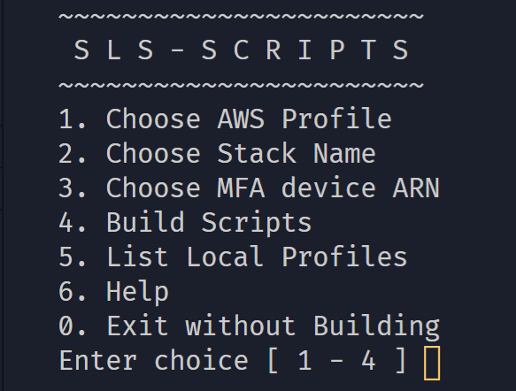

# Serverless Helper Scripts

> ℹ This script is to help developers save time while writing serverless applications when your team uses MFA.




## What does this do?

- Creates shortcut single commands that replace lengthy types sls commands
    - `serverless deploy --infraStackName my-stack-name --aws-profile my-aws-profile`
    - becomes...
    - `slsdeploy`
- Provides a simple UI to guide script creations
- Saves shortcut scripts to `~/bin` away from any projects and git repos.

## What does it not do?

- Save any details between sessions
- Interferre with anything inside projects
- Work at all in CI/CD environments, this is for developers locally to save time.
- Call the AWS API directly, we use the aws cli to do our work.


## Get started:

```sh
git clone https://github.com/leenattress/slsscripts.git
cs slsscripts
./slssetup.sh
```

## Main Menu

- **Choose AWS Profile**
    - Type your AWS profile name, as found in your `~/.aws/credentials` file.
- **Choose Stack Name**
    - We will add this string to the `--infraStackName` property on each command.
- **Choose MFA device ARN**
    - To get this string, go here: [IAM Users](https://console.aws.amazon.com/iam/home?region=us-east-1#/users), choose your account and press the *Security Credentials* tab. The arn value in the *Assigned MFA device* section is what we need.
    - We will use this to generate your mfa token when you use your authenticator app.
- **Build Scripts**
    - We will use the details you gave to pre-build some shortcut scripts and put them somewhere they can be called from anywhere in your terminal.
    - They will be stored in `~/bin`
    - Scripts are:
        - `slsinfo` - The same as `serverless info` but with your stack and profile appended
        - `slsdeploy` - The same as `serverless deploy` but with your stack and profile appended
        - `slsmfa` - A script to authenticate via MFA
- **List Local Profiles**
    - We read the local `~/.aws/credentials` file and show you only the account name. This is to help you fill out option 1, and to avoid any spelling errors and such.
- **Help**
    - Shows a brief help text
- **Exit Without Building**
    - Exits the script, deliberately forgetting all the details, does not save any files or modify anything.

### Special Note On Security

We do not store the details you have typed during configuration between `slssetup.sh` sessions deliberately, we only ever create files on your `~/bin` folder. You are free to go there and either delete the scripts or overwrite them by running the `slssetup.sh` script again.

### infraStackName?

Internally we use the stack name to structure our projects. We access it like this:

```yml
provider:
  name: aws
  runtime: nodejs12.x
  region: eu-west-2
  infraStackName: ${opt:infraStackName}
```

And elsewhere in your yaml: `${self:provider.infraStackName}`